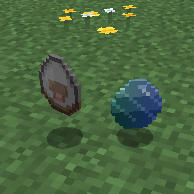
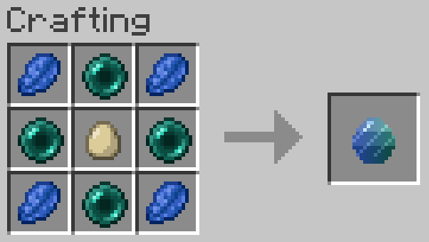

# Magic Egg

A Fabric mod that adds a Magic Egg - a throwable item that converts mobs into their spawn eggs.

## Screenshots





## Features

**Magic Egg**: A throwable projectile that instantly converts entities into spawn eggs
- Throw it at any mob to remove them and drop their spawn egg
- Works on any entity that has a spawn egg in vanilla Minecraft
- Does NOT work on players (for obvious reasons)
- Stacks up to 16
- If it misses (hits a block instead of a mob), there's a small chance it spawns something instead: usually a chicken, occasionally a random mob, and rarely a chicken on fire (a "lava chicken")
- Grants advancements for your first capture and for producing a lava chicken

## Crafting Recipe

Surround an egg with alternating lapis lazuli and ender pearls:

```
L E L
E G E
L E L
```

| Symbol | Item |
|--------|------|
| L | Lapis Lazuli |
| E | Ender Pearl |
| G | Egg |

## Requirements

- Targets the Minecraft, Fabric Loader, and Fabric API versions declared in this mod's `gradle.properties`. Check there for the exact currently-supported version
- Java version as declared in `fabric.mod.json`'s `depends` block
- Pandorical (see below)

## Pandorical

Magic Egg registers its own assets through Pandorical's content sync, and uses Pandorical's `thrown_item` entity renderer to display the flying egg projectile on Pandorical-enabled clients.

**The Pandorical mod must be installed client-side** to see the thrown egg rendered in flight.

## Installation

Install alongside its declared dependencies (see `fabric.mod.json`), including Pandorical on connecting clients.

## Building from Source

```bash
git clone https://github.com/fatlard1993/magic-egg.git
cd magic-egg
./gradlew build
```

The built jar will be in `build/libs/`.

## License

This project is licensed under the MIT License - see the [LICENSE](LICENSE) file for details.
